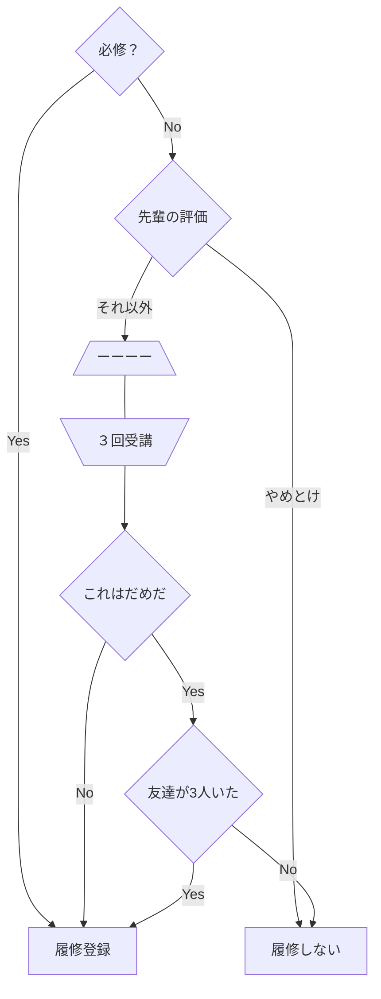

```mermaid

flowchart TD

hisshu{"必修？"}
senpai{"先輩の評価"}
loop[/"ーーーー"\]
loopend[\"３回受講"/]
dameda{"これはだめだ"}
tomodati{"友達が3人いた"}

rishu["履修登録"]
pass["履修しない"]

hisshu -->|Yes| rishu
hisshu -->|No| senpai
senpai -->|"それ以外"| loop
senpai -->|"やめとけ"| pass
loop --- loopend
loopend --> dameda
dameda -->|Yes| tomodati
dameda -->|No| rishu
tomodati --> |Yes| rishu
tomodati --> |No| pass
```
